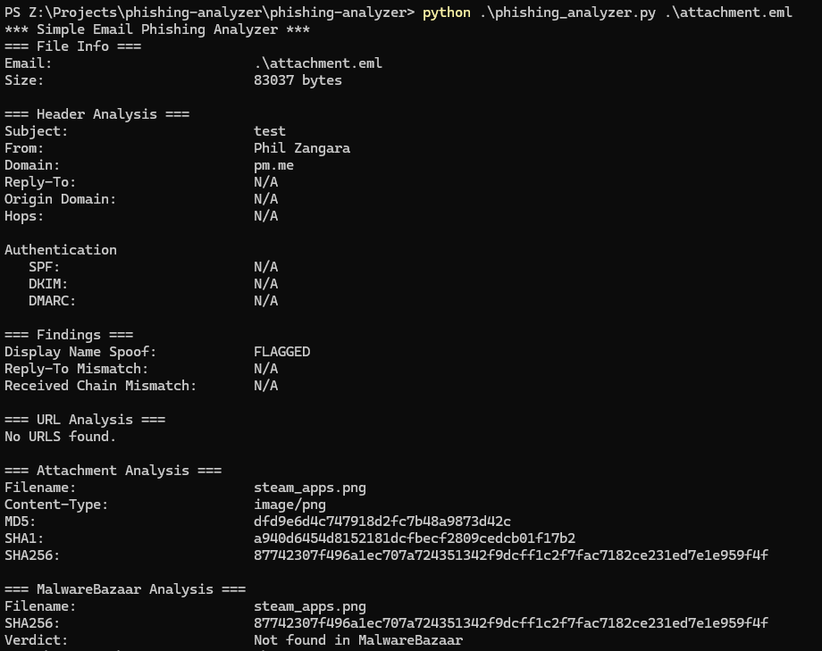

A simple email parsing tool for phishing analysis

Usage:

python phishing-analyzer.py <path-to-file.eml>

Tested using Python 3.10.11

Requirements:

pip install -r requirements.txt

Sample Data:

Test emails sourced from: https://github.com/rf-peixoto/phishing_pot/

Planned Phases
- [x] 1. Email Parsing
- [X] 2. Header Analysis
- [X] 3. URL Extraction (in progress
- [ ] 4. Attachment Analysis
- [ ] 5. Scoring and Report

## Sample Output

Author: Philip Zangara

License: MIT

Disclaimer: Built independently, with AI used as a learning aid for guidance and debugging feedback.